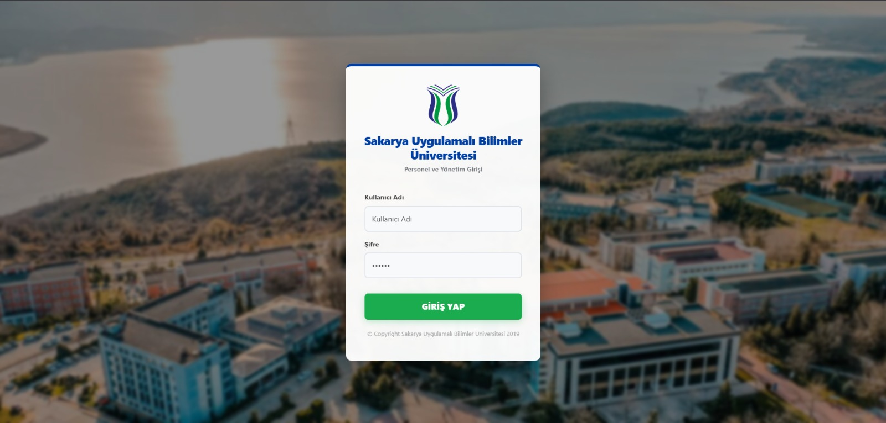
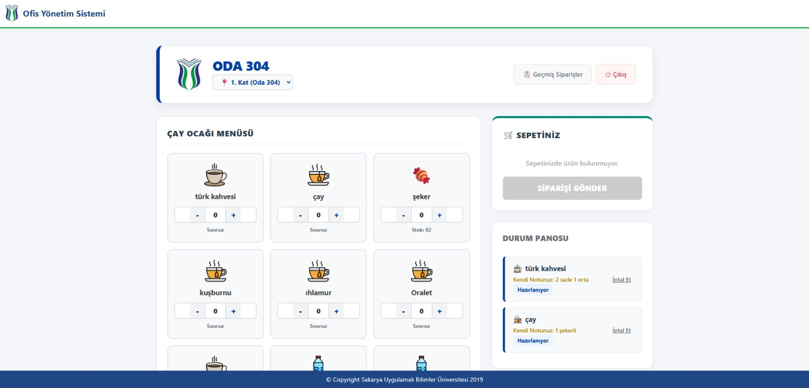
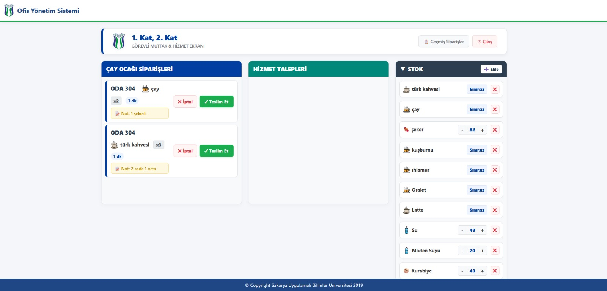
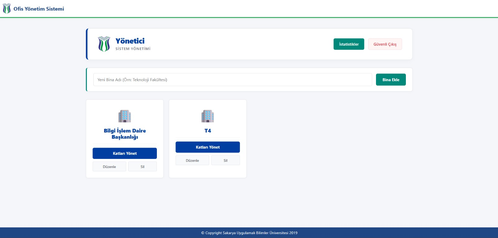
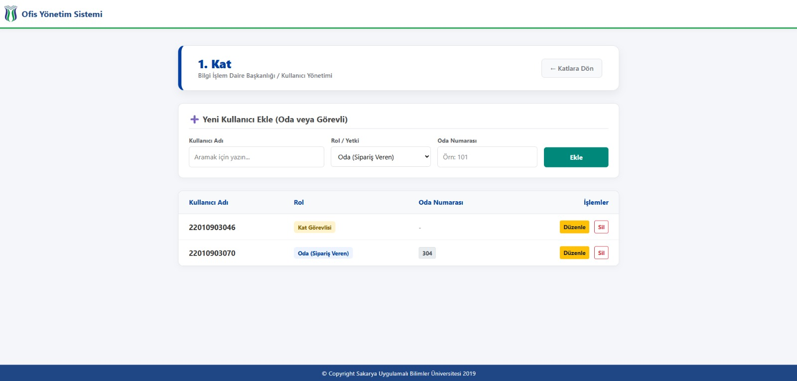
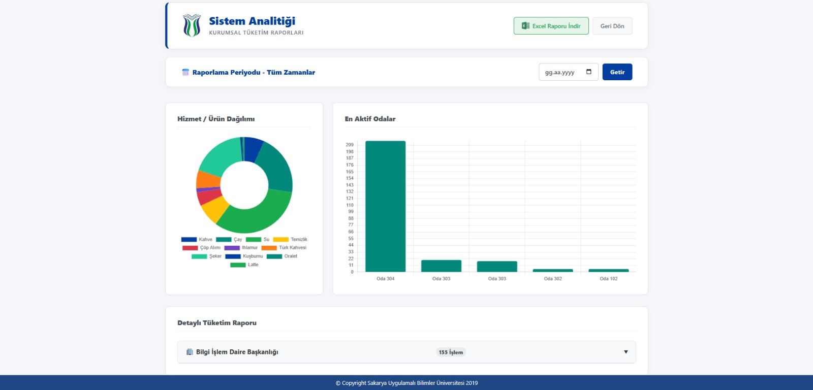
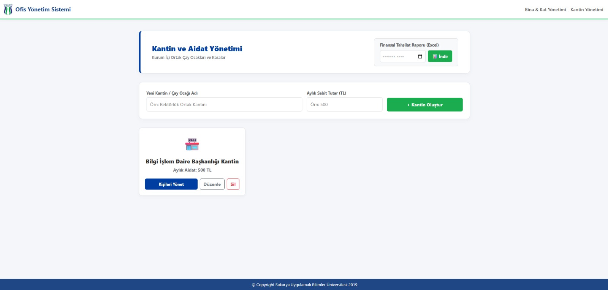
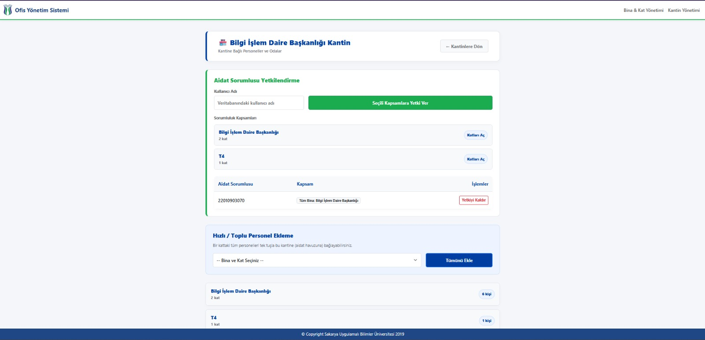
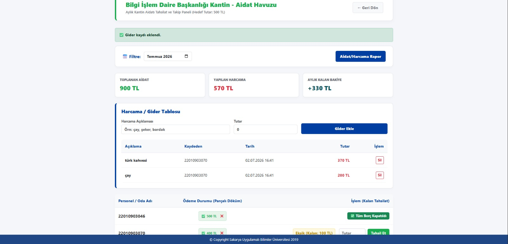
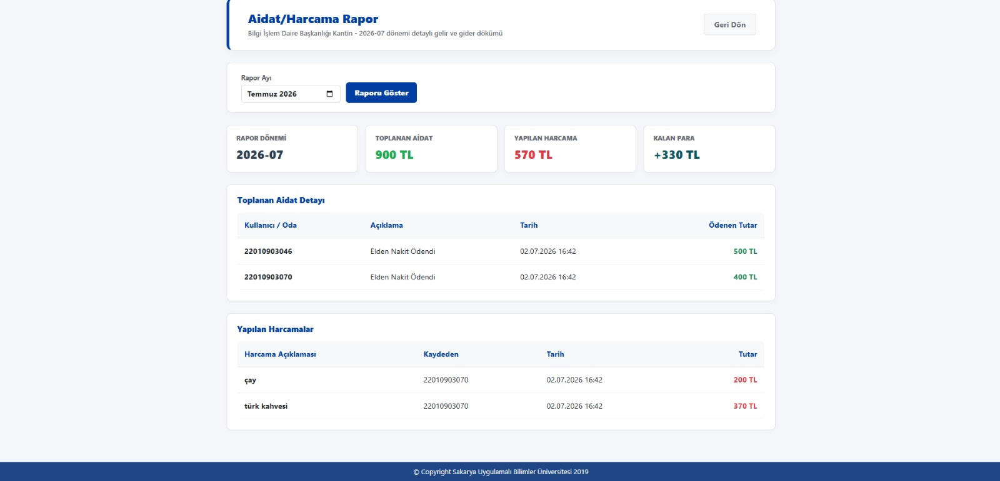

# ☕ Kurumsal Ofis Servis ve Sipariş Yönetim Sistemi (OYS)

[](https://dotnet.microsoft.com/)
[](https://www.microsoft.com/en-us/sql-server/)
[](https://learn.microsoft.com/en-us/aspnet/core/signalr/)
[]()

Kurumsal yapılar, üniversiteler ve büyük ofisler için geliştirilmiş; gerçek zamanlı iletişim, dinamik stok takibi ve veri analitiği modüllerini barındıran **Ofis Servis (Çay Ocağı & Hizmet) Otomasyonu**'dur. 

Geleneksel diyafon veya anlık mesajlaşma uygulamaları (WhatsApp vb.) üzerinden yürütülen karmaşık sipariş süreçlerini dijitalleştirir. Mutfak, kat görevlileri ve kurum personeli arasındaki iş akışını tek bir merkezden, anlık ve raporlanabilir şekilde yönetir.

---

##  Projede Geliştirilen Temel Özellikler

### 1. Gerçek Zamanlı Sipariş Yönetimi (SignalR)
Personel tarafından verilen siparişler, sayfa yenilenmesine gerek kalmadan milisaniyeler içinde ilgili kat görevlisinin ekranına düşer ve sesli bildirim ile uyarı verir. Durum güncellemeleri (Hazırlanıyor, Teslim Edildi, İptal Edildi) anlık olarak çift taraflı senkronize edilir.

### 2. Akıllı Otomatik Onay Motoru (Lazy Check)
Kat görevlisinin teslim ettiği bir sipariş, kullanıcı yoğunluktan dolayı "Teslim Aldım" onayı vermeyi unutursa sistemde askıda kalmaz. Arka planda çalışan *Lazy Check* algoritması, 120 dakika boyunca işlem görmeyen "Teslim Edildi" statüsündeki siparişleri otomatik olarak "Tamamlandı" durumuna geçirir ve ekranı temizler.

### 3. Harici API Entegreli Canlı Arama (Autocomplete)
Sisteme yeni personel/oda tanımlanırken, geliştirilen akıllı arama motoru devreye girer. Kullanıcı adı yazılırken sistem hem yerel veritabanını hem de kurumun harici API'sini eşzamanlı sorgulayarak canlı öneri (Autocomplete) sunar. Hayalet/hatalı kullanıcı girişleri backend seviyesinde engellenir.

### 4. İş Zekası ve Gelişmiş Sistem Analitiği
Kurum yöneticilerinin (Süper Admin) tüketim trendlerini ve en aktif odaları inceleyebildiği raporlama paneli mevcuttur.
* **Tarih Bazlı Filtreleme:** İstenilen günün bina, kat ve oda bazlı hiyerarşik tüketim verileri listelenebilir.
* **Dinamik Grafiklendirme:** Chart.js kullanılarak hizmet dağılımları ve aktif odalar görselleştirilir.
* **Excel (CSV) Raporlama:** Filtrelenen tarih aralığına ait tüm tüketim verileri, Türkiye Excel standartlarına (UTF-8 BOM, noktalı virgül) tam uyumlu şekilde tek tıkla indirilebilir.

### 5. Esnek Mutfak ve Kat Yönetimi
Kat görevlileri kendi ekranları üzerinden stokları dinamik olarak yönetebilir (akordeon liste tasarımı), ürünleri sınırsız moda alabilir. Molaya çıkıldığında sistem sipariş alımına kapatılabilir ve kat geneline anlık durum duyuruları (Örn: "Çay makinesi arızalıdır") geçilebilir.

### 6. PWA (Progressive Web App) Desteği
Service Worker ve manifest entegrasyonu sayesinde proje, kullanıcıların telefon veya masaüstü cihazlarına yerel bir uygulama gibi (tarayıcı çubuğu olmadan) kurulabilir.

---

## Teknolojik Altyapı

* **Backend:** C#, ASP.NET Core MVC (.NET 8.0)
* **Veritabanı:** Entity Framework Core (Code First), SQL Server
* **Gerçek Zamanlı İletişim:** SignalR
* **Frontend:** Saf (Vanilla) HTML5, CSS3, JavaScript (Harici CSS/JS kütüphanesi kullanılmamıştır)
* **Tasarım Mimarisi:** CSS Değişkenleri ile kurumsal tema yönetimi.

---

## Kurulum ve Yayına Alma Rehberi

Bu proje Docker ile çalışacak şekilde hazırlanmıştır. Projeyi GitHub üzerinden ZIP olarak indiren veya klonlayan bir kişi, aşağıdaki adımları izleyerek uygulamayı kendi bilgisayarında ya da sunucuda ayağa kaldırabilir.

### Gereksinimler

Projeyi çalıştıracak bilgisayarda veya sunucuda şu araçlar kurulu olmalıdır:

* Docker
* Docker Compose
* İnternet bağlantısı
* 8080 portunun kullanılabilir olması

Docker kurulu değilse önce Docker Desktop veya sunucu ortamına uygun Docker Engine kurulmalıdır.

---

### Projeyi ZIP Olarak İndirip Çalıştırma

GitHub üzerinden proje ZIP olarak indirildikten sonra dosya çıkarılır. Ardından `docker-compose.yml` dosyasının bulunduğu proje klasöründe terminal açılır.

Önce örnek ortam değişkenleri dosyası `.env` adıyla kopyalanır:

```powershell
Copy-Item .env.example .env
```

Linux sunucuda aynı işlem şu şekilde yapılabilir:

```bash
cp .env.example .env
```

Daha sonra `.env` dosyası açılıp gerekli bilgiler doldurulur.

Örnek `.env` içeriği:

```env
MSSQL_SA_PASSWORD=GucluBirSifre123!
SUPER_ADMIN_KULLANICI_ADI=
SCHOOL_API_LOGIN_URL=
SCHOOL_API_SEARCH_USER_URL=
```

Minimum çalıştırma için `MSSQL_SA_PASSWORD` alanının güçlü bir SQL Server şifresiyle doldurulması yeterlidir.

Okul API entegrasyonu kullanılacaksa şu alanlar da doldurulmalıdır:

```env
SCHOOL_API_LOGIN_URL=
SCHOOL_API_SEARCH_USER_URL=
```

Bu bilgiler GitHub reposunda bilinçli olarak boş bırakılmıştır. Gerçek okul API adresleri ve prod şifreleri GitHub'a yüklenmez, sadece çalıştırılan bilgisayardaki `.env` dosyasında tutulur.

---

### Uygulamayı Başlatma

`.env` dosyası hazırlandıktan sonra aşağıdaki komut çalıştırılır:

```powershell
docker compose up --build
```

Linux sunucuda da aynı komut kullanılabilir:

```bash
docker compose up --build
```

İlk çalıştırmada Docker gerekli imajları indirir, uygulamayı build eder, SQL Server container'ını başlatır ve web uygulamasını ayağa kaldırır.

Uygulama açıldığında tarayıcıdan şu adrese gidilir:

```text
http://localhost:8080
```

Sunucuda çalıştırılıyorsa `localhost` yerine sunucunun IP adresi veya domain adı kullanılır:

```text
http://SUNUCU_IP_ADRESI:8080
```

---

### İlk Giriş Bilgileri

Veritabanı ilk kez oluşturulduğunda sistem otomatik seed verisi üretir.

Varsayılan ilk admin hesabı:

```text
Kullanıcı adı: superadmin
Şifre: 123456
```

Bu kullanıcı okul API bilgisi olmadan sisteme giriş yapabilir. Böylece projeyi indiren kişi okul API adreslerini bilmeden de uygulamayı test edebilir.

---

### Veritabanı, Migration ve Seed İşlemleri

Projede Entity Framework Core migration dosyaları mevcuttur. Uygulama Docker ile ayağa kalkarken şu işlemler otomatik yapılır:

* SQL Server container'ı başlatılır.
* Uygulama SQL Server hazır olana kadar bekler.
* Bekleyen migration'lar otomatik uygulanır.
* Veritabanı tabloları oluşturulur.
* Başlangıç seed verileri eklenir.
* `superadmin / 123456` kullanıcısı oluşturulur.

Bu işlemler `Data/DatabaseInitializer.cs` dosyası üzerinden yürütülür.

Ayrıca Docker Compose içinde SQL Server verisi kalıcı volume üzerinde tutulur:

```text
sql_data
```

Bu sayede container kapatılıp tekrar açıldığında veritabanı verileri silinmez.

---

### Sunucuda Çalıştırma

Okul sunucusunda çalıştırmak için sunucuda Docker ve Docker Compose kurulu olmalıdır.

Sunucuda yapılacak temel adımlar:

```bash
cp .env.example .env
nano .env
docker compose up --build -d
```

Arka planda çalıştırmak için `-d` parametresi kullanılır:

```bash
docker compose up --build -d
```

Container durumlarını görmek için:

```bash
docker compose ps
```

Logları görmek için:

```bash
docker compose logs -f
```

Uygulamayı durdurmak için:

```bash
docker compose down
```

Veritabanı volume'ünü silmeden uygulamayı durdurmak için sadece `docker compose down` kullanılmalıdır. Volume silinirse veritabanı verileri de silinebilir.

---

### Port Bilgileri

Varsayılan portlar:

* Web uygulaması: `8080`
* SQL Server: `1433`

Web uygulaması şu adresten çalışır:

```text
http://localhost:8080
```

Sunucuda dış erişim verilecekse 8080 portunun firewall üzerinden açık olması gerekir.

SQL Server sadece uygulama tarafından kullanılacaksa 1433 portunun dış dünyaya açılması şart değildir.

---

### Sık Karşılaşılan Durumlar

Eğer uygulama açılmıyorsa:

```bash
docker compose logs -f
```

komutu ile hata logları kontrol edilebilir.

Eğer 8080 portu doluysa `docker-compose.yml` içindeki port eşlemesi değiştirilebilir:

```yaml
ports:
  - "8081:8080"
```

Bu durumda uygulama şu adresten açılır:

```text
http://localhost:8081
```

Eğer okul numarası ve okul şifresiyle giriş çalışmıyorsa `.env` dosyasındaki okul API ayarları kontrol edilmelidir:

```env
SCHOOL_API_LOGIN_URL=
SCHOOL_API_SEARCH_USER_URL=
```

Okul API bilgileri girilmemiş olsa bile sistem `superadmin / 123456` hesabıyla test edilebilir.

---

## Ekran Görüntüleri ve Arayüz Turu

### 1. Sisteme Giriş (Login)
Role-Based Access Control (RBAC) ile güvenli yetkilendirme ve kurumsal giriş ekranı.



### 2. Personel / Oda Ekranı
Gerçek zamanlı sepet, ürün seçimi ve anlık sipariş durumu takip panosu.



### 3. Görevli (Mutfak / Hizmet) Ekranı
Anlık siparişlerin düştüğü, stok ve mola yönetiminin yapıldığı kat görevlisi kontrol merkezi.



### 4. Sistem ve Bina Yönetimi (Süper Admin)
Kurumun hiyerarşik altyapısının (Binalar ve Katlar) yönetildiği ana panel.



### 5. Personel Tanımlama (Canlı Arama Modülü)
API destekli "Autocomplete" arama motoru ile odalara/katlara personel atama ekranı.



### 6. Sistem Analitiği ve Raporlama
Tarih filtreli dinamik grafikler ve Excel çıktısı alınabilen iş zekası paneli.



### 7. Kantin ve Aidat Yönetimi
Kurum içerisindeki kantin veya çay ocağı tanımlama, aylık aidat tutarı belirleme ve ilgili kantine bağlı kişileri yönetme ekranıdır.



### 8. Aidat Sorumlusu Yetkilendirme
Belirli kullanıcılara bina veya kat bazlı aidat tahsilatı ve takip yetkisi verme ekranıdır.



### 9. Aidat Kantin Havuzu
Seçilen kantine ait aylık aidat tahsilatlarının, parçalı ödemelerin, kalan borçların ve gider kayıtlarının takip edildiği ekrandır.



### 10. Aidat Harcama Raporu
Seçilen aya ait toplanan aidat, yapılan harcama ve kalan bakiye bilgilerinin detaylı olarak listelendiği rapor ekranıdır.



---


